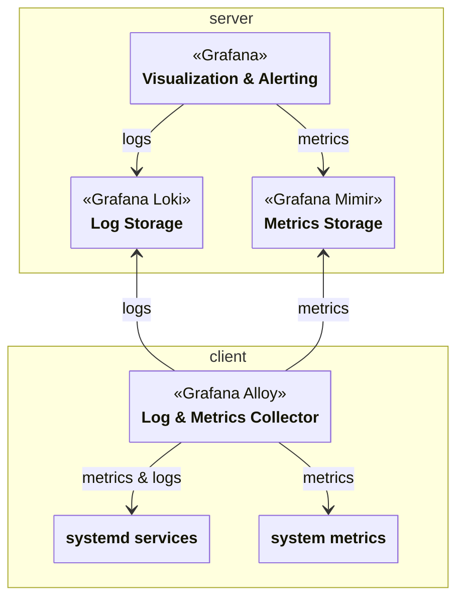

## Usage

```nix
inventory.instances = {
  monitoring = {
    module = {
      name = "monitoring";
      input = "clan-core";
    };

    roles = {
      client = {
        # Enable monitoring for all machines in the clan.
        tags = [ "all" ];
        # Decide whether or not your server is reachable via https.
        settings.useSSL = true;
      };

      # Select one machine as the central monitoring server.
      # Hint: This is currently limited to exactly one server.
      server.machines.<machine>.settings = {
        # Optionally enable grafana for dashboards and alerts.
        grafana.enable = true;
      };
    };
  };
};
```

## Architecture Overview



## Roles

### Client

Clients are machines that create metrics and logs. Those are sent to the central monitoring server for storage and visualization.

### Server

Servers store metrics and logs. They also provide optional dashboards for visualization and an alerting system.
