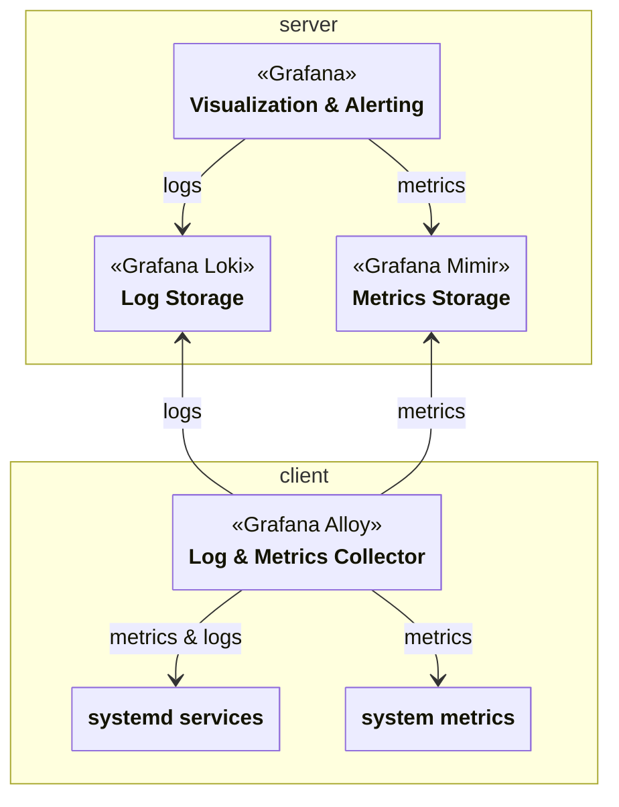

:::admonition[Experimental]{type=danger}
This service is experimental and will change in the future.

:::

## Usage

```nix
inventory.instances = {
  monitoring = {
    module = {
      name = "monitoring";
      input = "clan-core";
    };

    roles = {
      client = {
        # Enable monitoring for all machines in the clan.
        tags = [ "all" ];
        # Decide whether or not your server is reachable via https.
        settings.useSSL = true;
        settings.loki.journal.relabelRules.beforeNormalization = [
          ''
            // Create labels from raw journal fields.
            rule {
              source_labels = ["__journal_com_docker_swarm_service_name"]
              regex = "^.*_(.*)$"
              target_label = "oci_platform_service_name"
            }
          ''
        ];
        settings.loki.journal.relabelRules.afterNormalization = [
          ''
            // Drop debug-level logs after `level` is created.
            rule {
              action = "drop"
              source_labels = ["level"]
              regex = "debug"
            }
          ''
        ];
      };

      # Select one machine as the central monitoring server.
      # Hint: This is currently limited to exactly one server.
      server.machines.<machine>.settings = {
        # Optionally enable grafana for dashboards and alerts.
        grafana.enable = true;
      };
    };
  };
};
```

## Architecture Overview


```mermaid
---
  config:
    class:
      hideEmptyMembersBox: true
---
classDiagram
    namespace server {
        class `Visualization & Alerting` {<<Grafana>>}
        class `Log Storage` {<<Grafana Loki>>}
        class `Metrics Storage` {<<Grafana Mimir>>}
    }

    namespace client {
        class `Log & Metrics Collector` {<<Grafana Alloy>>}
        class `systemd services`
        class `system metrics`
    }

    `Visualization & Alerting` --> `Metrics Storage` : metrics
    `Visualization & Alerting` --> `Log Storage` : logs
    `Log Storage` <-- `Log & Metrics Collector` : logs
    `Metrics Storage` <-- `Log & Metrics Collector` : metrics
    `Log & Metrics Collector` --> `system metrics` : metrics
    `Log & Metrics Collector` --> `systemd services` : metrics & logs
```

## Roles

### Client

Clients are machines that create metrics and logs. Those are sent to the central monitoring server for storage and visualization.

Journal relabeling can be customized in two phases:

- `settings.loki.journal.relabelRules.beforeNormalization` for raw journal labels such as `__journal__*`
- `settings.loki.journal.relabelRules.afterNormalization` for normalized labels such as `instance`, `service_name`, and `level`

The generated monitoring collector config is installed as `/etc/alloy/config.alloy`.
Additional local collector fragments can be added with `environment.etc."alloy/<name>.alloy"`.

### Server

Servers store metrics and logs. They also provide optional dashboards for visualization and an alerting system.
