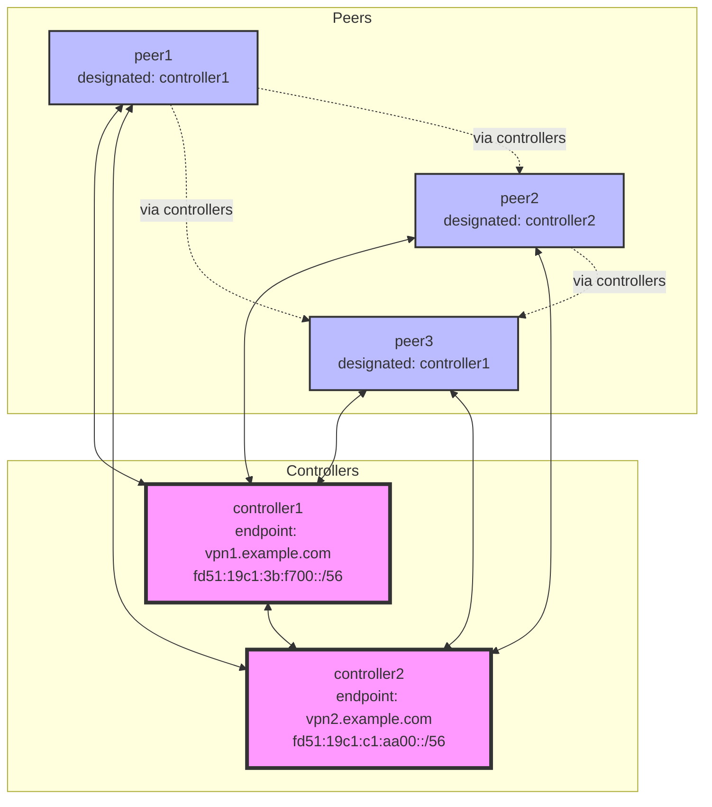

# Wireguard VPN Service

This service provides a Wireguard-based VPN mesh network with automatic IPv6 address allocation and routing between clan machines.

## Overview

The wireguard service creates a secure mesh network between clan machines using two roles:
- **Controllers**: Machines with public endpoints that act as connection points and routers
- **Peers**: Machines that connect through controllers to access the network

## Requirements

- Controllers must have a publicly accessible endpoint (domain name or static IP)
- Peers must be in networks where UDP traffic is not blocked (uses port 51820 by default, configurable)

## Features

- Automatic IPv6 address allocation using ULA (Unique Local Address) prefixes
- Full mesh connectivity between all machines
- Automatic key generation and distribution
- IPv6 forwarding on controllers for inter-peer communication
- Support for multiple controllers for redundancy

## Network Architecture

### IPv6 Address Allocation
- Base network: `/40` ULA prefix (deterministically generated from instance name)
- Controllers: Each gets a `/56` subnet from the base `/40`
- Peers: Each gets a unique 64-bit host suffix that is used in ALL controller subnets

### Addressing Design
- Each peer generates a unique host suffix (e.g., `:8750:a09b:0:1`)
- This suffix is appended to each controller's `/56` prefix to create unique addresses
- Example: peer1 with suffix `:8750:a09b:0:1` gets:
  - `fd51:19c1:3b:f700:8750:a09b:0:1` in controller1's subnet
  - `fd51:19c1:c1:aa00:8750:a09b:0:1` in controller2's subnet
- Controllers allow each peer's `/96` subnet for routing flexibility

### Connectivity
- Peers use a single WireGuard interface with multiple IPs (one per controller subnet)
- Controllers connect to ALL other controllers and ALL peers on a single interface
- Controllers have IPv6 forwarding enabled to route traffic between peers
- All traffic between peers flows through controllers
- Symmetric routing is maintained as each peer has consistent IPs across all controllers

### Example Network Topology



## Configuration

### Basic Setup with Single Controller

```nix
# In your flake.nix or inventory
{
  services.wireguard.server1 = {
    roles.controller = {
      # Public endpoint where this controller can be reached
      endpoint = "vpn.example.com";
      # Optional: Change the UDP port (default: 51820)
      port = 51820;
    };
  };

  services.wireguard.laptop1 = {
    roles.peer = {
      # No configuration needed if only one controller exists
    };
  };
}
```

### Multiple Controllers Setup

```nix
{
  services.wireguard.server1 = {
    roles.controller = {
      endpoint = "vpn1.example.com";
    };
  };

  services.wireguard.server2 = {
    roles.controller = {
      endpoint = "vpn2.example.com";
    };
  };

  services.wireguard.laptop1 = {
    roles.peer = {
      # Must specify which controller subnet is exposed as the default in /etc/hosts, when multiple controllers exist
      controller = "server1";
    };
  };
}
```

### Advanced Options


### Automatic Hostname Resolution

The wireguard service automatically adds entries to `/etc/hosts` for all machines in the network. Each machine is accessible via its hostname in the format `<machine-name>.<instance-name>`.

For example, with an instance named `vpn`:
- `server1.vpn` - resolves to server1's IPv6 address
- `laptop1.vpn` - resolves to laptop1's IPv6 address

This allows machines to communicate using hostnames instead of IPv6 addresses:

```bash
# Ping another machine by hostname
ping6 server1.vpn

# SSH to another machine
ssh user@laptop1.vpn
```

## Troubleshooting

### Check Wireguard Status
```bash
sudo wg show
```

### Verify IP Addresses
```bash
ip addr show dev <instance-name>
```

### Check Routing
```bash
ip -6 route show dev <instance-name>
```

### Interface Fails to Start: "Address already in use"

If you see this error in your logs:
```
wireguard: Could not bring up interface, ignoring: Address already in use
```

This means the configured port (default: 51820) is already in use by another service or wireguard instance. Solutions:

1. **Check for conflicting wireguard instances:**
   ```bash
   sudo wg show
   sudo ss -ulnp | grep 51820
   ```

2. **Use a different port:**
   ```nix
   services.wireguard.myinstance = {
     roles.controller = {
       endpoint = "vpn.example.com";
       port = 51821;  # Use a different port
     };
   };
   ```

3. **Ensure unique ports across multiple instances:**
   If you have multiple wireguard instances on the same machine, each must use a different port.

### Key Management

Keys are automatically generated and stored in the clan vars system. To regenerate keys:

```bash
# Regenerate keys for a specific machine and instance
clan vars generate --service wireguard-keys-<instance-name> --regenerate --machine <machine-name>

# Apply the new keys
clan machines update <machine-name>
```

## Security Considerations

- All traffic is encrypted using Wireguard's modern cryptography
- Private keys never leave the machines they're generated on
- Public keys are distributed through the clan vars system
- Controllers must have publicly accessible endpoints
- Firewall rules are automatically configured for the Wireguard ports

