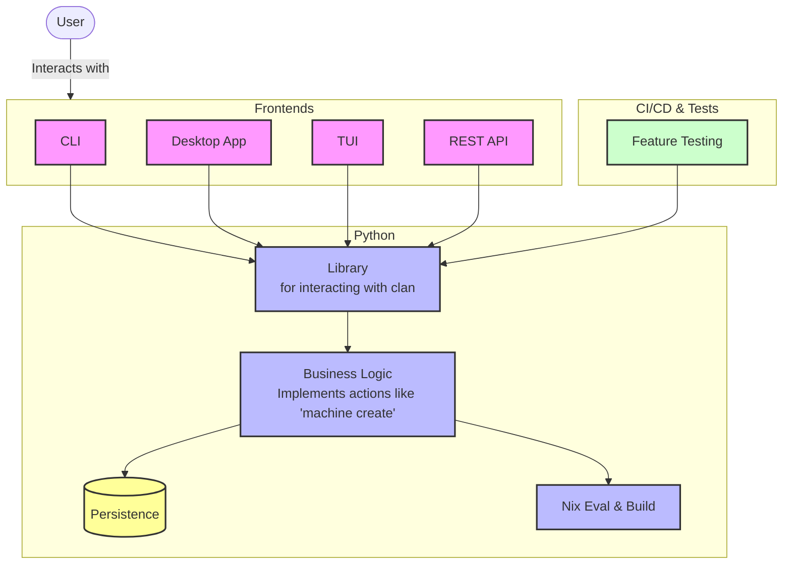

# Clan as library

## Status

Accepted

## Context

In the long term we envision the clan application will consist of the following user facing tools in the long term.

- `CLI`
- `TUI`
- `Desktop Application`
- `REST-API`
- `Mobile Application`

We might not be sure whether all of those will exist but the architecture should be generic such that those are possible without major changes of the underlying system.

## Decision

This leads to the conclusion that we should do `library` centric development.
With the current `clan` python code beeing a library that can be imported to create various tools ontop of it.
All **CLI** or **UI** related parts should be moved out of the main library.

*Note: The next person who wants implement any new frontend should do this first. Currently it looks like the TUI is the next one.*

Imagine roughly the following architecture:

With this very simple design it is ensured that all the basic features remain stable across all frontends.
In the end it is straight forward to create python library function calls in a testing framework to ensure that kind of stability.

Integration tests and smaller unit-tests should both be utilized to ensure the stability of the library.

Note: Library function don't have to be json-serializable in general.

Persistence includes but is not limited to: creating git commits, writing to inventory.json, reading and writing vars and to/from disk in general.

## Benefits / Drawbacks

- (+) Less tight coupling of frontend- / backend-teams
- (+) Consistency and inherent behavior
- (+) Performance & Scalability
- (+) Different frontends for different user groups
- (+) Documentation per library function makes it convenient to interact with the clan resources.
- (+) Testing the library ensures stability of the underlyings for all layers above.
- (-) Complexity overhead
- (-) library needs to be designed / documented
- (+) library can be well documented since it is a finite set of functions.
- (-) Error handling might be harder.
- (+) Common error reporting
- (-) different frontends need different features. The library must include them all.
- (+) All those core features must be implemented anyways.
- (+) VPN Benchmarking uses the existing library's already and works relatively well.

## Implementation considerations

Not all required details that need to change over time are possible to be pointed out ahead of time.
The goal of this document is to create a common understanding for how we like our project to be structured.
Any future commits should contribute to this goal.

Some ideas what might be needed to change:

- Having separate locations or packages for the library and the CLI.
- Rename the `clan_cli` package to `clan` and move the `cli` frontend into a subfolder or a separate package.
- Python Argparse or other cli related code should not exist in the `clan` python library.
- `__init__.py` should be very minimal. Only init the business logic models and resources. Note that all `__init__.py` files all the way up in the module tree are always executed as part of the python module import logic and thus should be as small as possible.
  i.e. `from clan_cli.vars.generators import ...` executes both `clan_cli/__init__.py` and `clan_cli/vars/__init__.py` if any of those exist.
- `api` folder doesn't make sense since the python library `clan` is the api.
- Logic needed for the webui that performs json serialization and deserialization will be some `json-adapter` folder or package.
- Code for serializing dataclasses and typed dictionaries is needed for the persistence layer. (i.e. for read-write of inventory.json)
- The inventory-json is a backend resource, that is internal. Its logic includes merging, unmerging and partial updates with considering nix values and their priorities. Nobody should try to read or write to it directly.
  Instead there will be library methods i.e. to add a `service` or to update/read/delete some information from it.
- Library functions should be carefully designed with suitable conventions for writing good api's in mind. (i.e: https://swagger.io/resources/articles/best-practices-in-api-design/)

