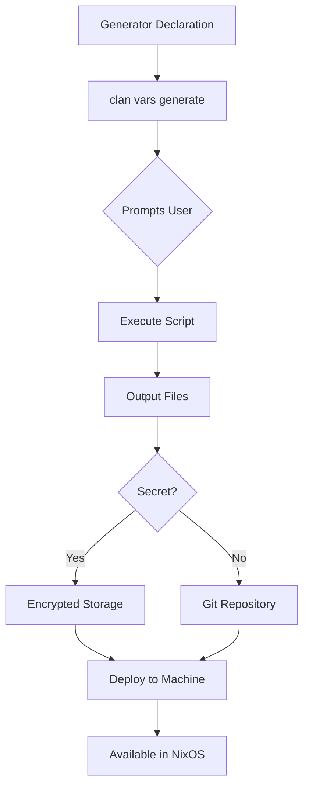

# Vars System Overview

The vars system is clan's declarative solution for managing generated files, secrets, and dynamic configuration in your NixOS deployments. It eliminates the manual steps of generating credentials, certificates, and other dynamic values by automating these processes within your infrastructure-as-code workflow.

## What Problems Does Vars Solve?

### Before Vars: Manual Secret Management

Traditional NixOS deployments require manual steps for secrets and generated files:

```bash
# Generate password hash manually
mkpasswd -m sha-512 > /tmp/root-password-hash
# Copy hash into configuration
users.users.root.hashedPasswordFile = "/tmp/root-password-hash";
```

This approach has several problems:

- **Not reproducible**: Manual steps vary between team members

- **Hard to maintain**: Updating secrets requires remembering manual commands  

- **Deployment friction**: Secrets must be managed outside of your configuration

- **Team collaboration issues**: Sharing credentials securely is complex

### After Vars: Declarative Generation

With vars, the same process becomes declarative and automated:

```nix
clan.core.vars.generators.root-password = {
  prompts.password.description = "Root password";
  prompts.password.type = "hidden";
  files.hash.secret = false;
  script = "mkpasswd -m sha-512 < $prompts/password > $out/hash";
  runtimeInputs = [ pkgs.mkpasswd ];
};

users.users.root.hashedPasswordFile = 
  config.clan.core.vars.generators.root-password.files.hash.path;
```

## Core Benefits

- **🔄 Reproducible**: Same inputs always produce the same outputs
- **📝 Declarative**: Defined alongside your NixOS configuration
- **🔐 Secure**: Automatic secret storage and encrypted deployment
- **👥 Collaborative**: Built-in sharing for team environments
- **🚀 Automated**: No manual intervention required for deployments
- **🔗 Integrated**: Works seamlessly with clan's deployment workflow

## How It Works



1. **Declare generators** in your NixOS configuration
2. **Generate values** using `clan vars generate` (or automatically during deployment)
3. **Store securely** in encrypted backends or version control
4. **Deploy seamlessly** to your machines where they're accessible as file paths

## Common Use Cases

| Use Case | What Gets Generated | Benefits |
|----------|-------------------|----------|
| **User passwords** | Password hashes | No plaintext in config |
| **SSH keys** | Host/user keypairs | Automated key rotation |
| **TLS certificates** | Certificates + private keys | Automated PKI |
| **Database credentials** | Passwords + connection strings | Secure service communication |
| **API tokens** | Random tokens | Service authentication |
| **Configuration files** | Complex configs with secrets | Dynamic config generation |

## Architecture Overview

The vars system has three main components:

### 1. **Generators**
Define how to create files from inputs:

- **Prompts**: Values requested from users

- **Scripts**: Generation logic  

- **Dependencies**: Other generators this depends on

- **Outputs**: Files that get created

### 2. **Storage Backends**
Handle secret storage and deployment:

- **sops**: Encrypted files in git (recommended)

- **password-store**: GPG/age-based secret storage

## Quick Start Example

Here's a complete example showing password generation and usage:

```nix
# generator.nix
{ config, pkgs, ... }: {
  clan.core.vars.generators.user-password = {
    prompts.password = {
      description = "User password";
      type = "hidden";
    };
    files.hash = { secret = false; };
    script = ''
      mkpasswd -m sha-512 < $prompts/password > $out/hash
    '';
    runtimeInputs = [ pkgs.mkpasswd ];
  };
  
  users.users.myuser = {
    hashedPasswordFile = 
      config.clan.core.vars.generators.user-password.files.hash.path;
  };
}
```

```bash
# Generate the password
clan vars generate my-machine

# Deploy to machine
clan machines update my-machine
```

## Migration from Facts

If you're currently using the legacy facts system, see our [Migration Guide](../migrations/migration-facts-vars.md) for step-by-step instructions on upgrading to vars.

