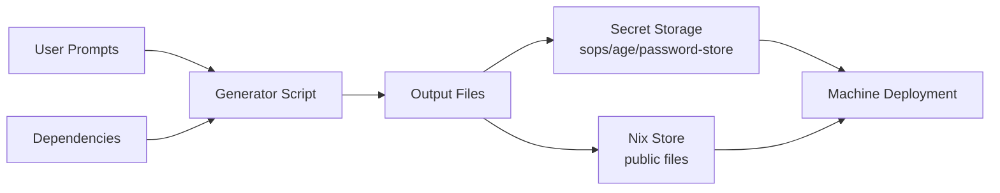
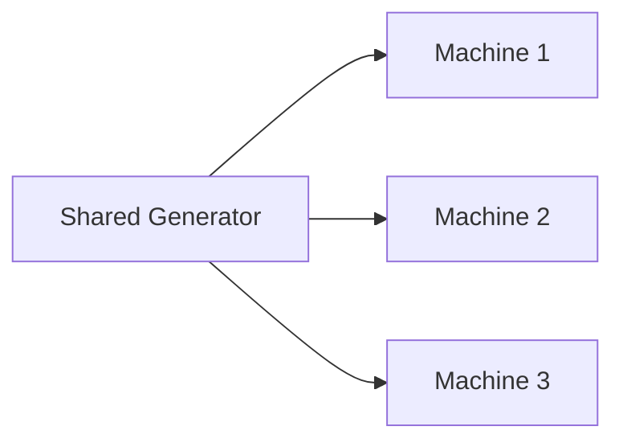

# Vars Concepts

## Clan Vars Architecture

The vars system provides a declarative, reproducible way to manage generated files (especially secrets) in NixOS configurations. This page covers how the pieces fit together.

### Data Flow



### Design Principles

**Declarative generation.** Unlike imperative secret management, vars are declared in your NixOS configuration and generated deterministically, making deployments reproducible.

**Separation of concerns.** Generation logic lives in generator scripts. Storage is handled by pluggable backends (sops, password-store, etc.). Deployment runs through NixOS activation scripts. Access control is enforced through file permissions and ownership.

**Composability through dependencies.** Generators can depend on outputs from other generators, enabling complex workflows:

```text
# Dependencies create a directed acyclic graph (DAG)
A → B → C
    ↓
    D
```

You can build systems like certificate authorities where intermediate certificates depend on root certificates.

**Type safety.** Secret files are accessed via `.path` only (their plaintext content is never readable at evaluation time) and are deployed to `/run/secrets/` on the target machine (or `/run/secrets-for-users/` when `neededFor = "users"`). Public files are accessed via either `.path` or `.value` and are stored in the nix store. This separation prevents accidental exposure of secrets.

### Storage Backend Architecture

Pluggable storage backends handle encryption/decryption:

- `sops` (default): integrates with Clan's existing sops encryption
- `password-store`: for users already using pass
- `age`: stores secrets encrypted with age recipients
- `custom`: define your own secret store

### When Generation Runs

There are three ways to trigger generation:

1. **Explicitly, before deployment:** running `clan vars generate` creates any missing vars.
2. **Automatically, during deployment:** any missing vars are generated as part of `clan machines update`.
3. **On demand, to replace existing values:** passing the `--regenerate` flag forces regeneration of vars that already exist.

### Deployment Timing with `neededFor`

The `neededFor` option on a file controls *when on the target machine* a secret becomes available during system activation. Valid values are:

- `partitioning`: deployed before disko runs (e.g. for filesystem encryption keys)
- `activation`: deployed before `nixos-rebuild` / `nixos-install`
- `users`: deployed before users and groups are created (required for user passwords); stored in `/run/secrets-for-users/`
- `services`: the default; available to normal services at runtime

Example: a user password hash that must exist before the user account is created:

```nix
files."user-password-hash" = {
  neededFor = "users";
};
```

### Multi-Machine Coordination

Setting `share = true` on a generator enables cross-machine secret sharing:



Use cases include shared certificate authorities, mesh VPN pre-shared keys, and cluster join tokens.

### Generator Composition

Complex systems can be built by composing simple generators:

```
root-ca → intermediate-ca → service-cert
         ↓
     ocsp-responder
```

Each generator focuses on one task, keeping the system modular and testable.

### Key Advantages

Compared to manual secret management, vars provides:

- **Declarative configuration**: Define once, generate consistently
- **Dependency management**: Build complex systems with generator dependencies
- **Type safety**: Separate handling of secret and public files
- **User prompts**: Gather input when needed
- **Easy regeneration**: Update secrets with a single command
