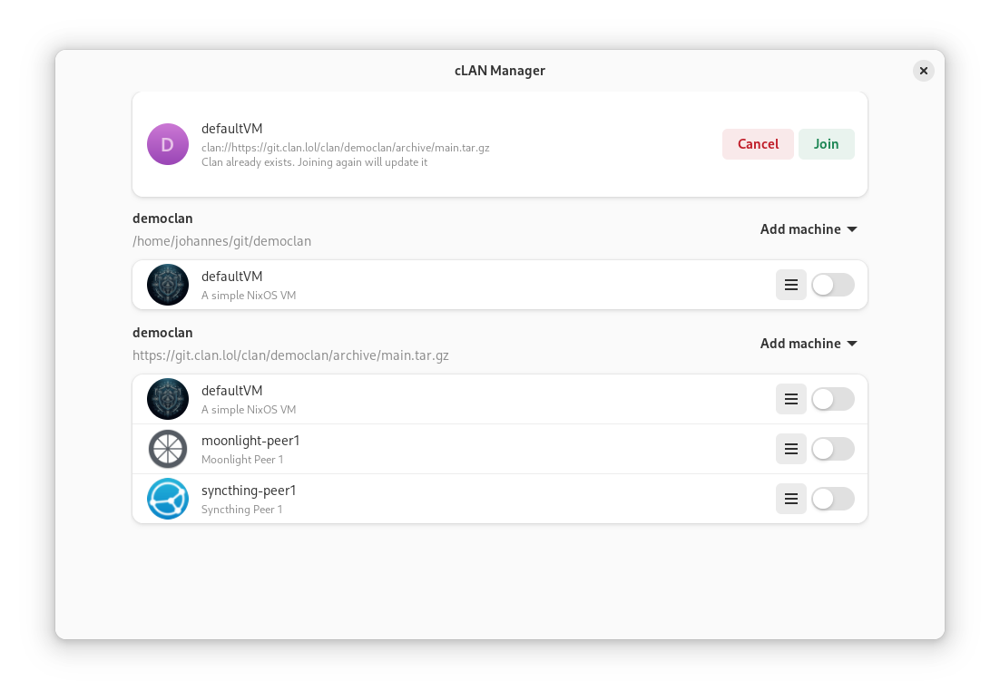

Sure, here's an improved version of your README:

# Clan App

A powerful application that allows users to create and manage their own clans.

## Getting Started

Follow the instructions below to set up your development environment and start the application.


1. **Navigate to the Webview UI Directory:**

   Go to the `clan-core/pkgs/webview-ui/app` directory and start the web server by executing:

   ```bash
   vite
   ```

2. **Start the Clan App:**

   In the `clan-app` directory, execute the following command:

   ```bash
   clan-app --debug --content-uri http://localhost:3000
   ```

This will start the application in debug mode and link it to the web server running at `http://localhost:3000`.


# clan app (old)

Provides users with the simple functionality to manage their locally registered clans.



## Available commands

Run this application

```bash
./bin/clan-app
```

Join the default machine of a clan

```bash
./bin/clan-app [clan-uri]
```

Join a specific machine of a clan

```bash
./bin/clan-app [clan-uri]#[machine]
```

For more available commands see the developer section below.

## Developing this Application

### Debugging Style and Layout

```bash
# Enable the GTK debugger
gsettings set org.gtk.Settings.Debug enable-inspector-keybinding true

# Start the application with the debugger attached
GTK_DEBUG=interactive ./bin/clan-app --debug
```

Appending `--debug` flag enables debug logging printed into the console.

### Profiling

To activate profiling you can run

```bash
PERF=1 ./bin/clan-app
```

### Library Components

> Note:
>
> we recognized bugs when starting some cli-commands through the integrated vs-code terminal.
> If encountering issues make sure to run commands in a regular os-shell.

lib-Adw has a demo application showing all widgets. You can run it by executing

```bash
adwaita-1-demo
```

GTK4 has a demo application showing all widgets. You can run it by executing

```bash
gtk4-widget-factory
```

To find available icons execute

```bash
gtk4-icon-browser
```

### Links

Here are some important documentation links related to the Clan App:

- [Adw PyGobject Reference](http://lazka.github.io/pgi-docs/index.html#Adw-1): This link provides the PyGObject reference documentation for the Adw library, which is used in the Clan App. It contains detailed information about the Adw widgets and their usage.

- [GTK4 PyGobject Reference](http://lazka.github.io/pgi-docs/index.html#Gtk-4.0): This link provides the PyGObject reference documentation for GTK4, the toolkit used for building the user interface of the clan app. It includes information about GTK4 widgets, signals, and other features.

- [Adw Widget Gallery](https://gnome.pages.gitlab.gnome.org/libadwaita/doc/main/widget-gallery.html): This link showcases a widget gallery for Adw, allowing you to see the available widgets and their visual appearance. It can be helpful for designing the user interface of the clan app.

- [Python + GTK3 Tutorial](https://python-gtk-3-tutorial.readthedocs.io/en/latest/textview.html): Although the clan app uses GTK4, this tutorial for GTK3 can still be useful as it covers the basics of building GTK-based applications with Python. It includes examples and explanations for various GTK widgets, including text views.

- [GNOME Human Interface Guidelines](https://developer.gnome.org/hig/): This link provides the GNOME Human Interface Guidelines, which offer design and usability recommendations for creating GNOME applications. It covers topics such as layout, navigation, and interaction patterns.

## Error handling

> Error dialogs should be avoided where possible, since they are disruptive.
>
> For simple non-critical errors, toasts can be a good alternative.