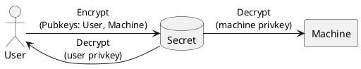
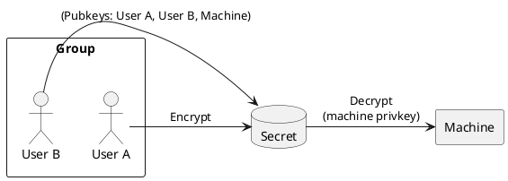
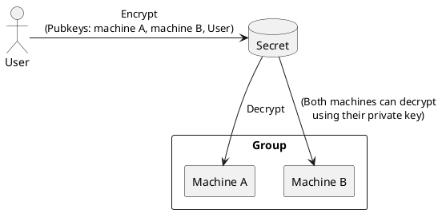

This article provides an overview over the underlying secrets system which is used by [Vars](../guides/vars/vars-overview.md).
Under most circumstances you should use [Vars](../guides/vars/vars-overview.md) directly instead.

Consider using `clan secrets` only for managing admin users and groups, as well as a debugging tool.

Manually interacting with secrets via `clan secrets [set|remove]`, etc may break the integrity of your `Vars` state.

---

Clan enables encryption of secrets (such as passwords & keys) ensuring security and ease-of-use among users.

By default, Clan uses the [sops](https://github.com/getsops/sops) format
and integrates with [sops-nix](https://github.com/Mic92/sops-nix) on NixOS machines.
Clan can also be configured to be used with other secret store [backends](../reference/clan.core/vars.md#clan.core.vars.settings.secretStore).

## Create Your Admin Keypair

To get started, you'll need to create **your admin keypair**.

!!! info
    Don't worry — if you've already made one before, this step won't change or overwrite it.

```bash
clan secrets key generate
```

**Output**:

```{.console, .no-copy}
Public key: age1wkth7uhpkl555g40t8hjsysr20drq286netu8zptw50lmqz7j95sw2t3l7

Generated age private key at '/home/joerg/.config/sops/age/keys.txt' for your user. Please back it up on a secure location or you will lose access to your secrets.
Also add your age public key to the repository with 'clan secrets users add YOUR_USER age1wkth7uhpkl555g40t8hjsysr20drq286netu8zptw50lmqz7j95sw2t3l7' (replace YOUR_USER with your actual username)
```

!!! warning
    Make sure to keep a safe backup of the private key you've just created.
    If it's lost, you won't be able to get to your secrets anymore because they all need the admin key to be unlocked.

If you already have an [age] secret key and want to use that instead, you can simply edit `~/.config/sops/age/keys.txt`:

```title="~/.config/sops/age/keys.txt"
AGE-SECRET-KEY-13GWMK0KNNKXPTJ8KQ9LPSQZU7G3KU8LZDW474NX3D956GGVFAZRQTAE3F4
```

Alternatively, you can provide your [age] secret key as an environment variable `SOPS_AGE_KEY`, or in a different file
using `SOPS_AGE_KEY_FILE`.
For more information see the [SOPS] guide on [encrypting with age].

!!! note
    It's safe to add any secrets created by the clan CLI and placed in your repository to version control systems like `git`.

## Add Your Public Key(s)

```console
clan secrets users add $USER --age-key <your_public_key>
```

It's best to choose the same username as on your Setup/Admin Machine that you use to control the deployment with.

Once run this will create the following files:

```{.console, .no-copy}
sops/
└── users/
    └── <your_username>/
        └── key.json
```
If you followed the quickstart tutorial all necessary secrets are initialized at this point.

!!! note
    You can add multiple age keys for a user by providing multiple `--age-key <your_public_key>` flags:

    ```console
    clan secrets users add $USER \
        --age-key <your_public_key_1> \
        --age-key <your_public_key_2> \
        ...
    ```

## Manage Your Public Key(s)

You can list keys for your user with `clan secrets users get $USER`:

```console
clan secrets users get alice

[
  {
    "publickey": "age1hrrcspp645qtlj29krjpq66pqg990ejaq0djcms6y6evnmgglv5sq0gewu",
    "type": "age",
    "username": "alice"
  },
  {
    "publickey": "age13kh4083t3g4x3ktr52nav6h7sy8ynrnky2x58pyp96c5s5nvqytqgmrt79",
    "type": "age",
    "username": "alice"
  }
]
```

To add a new key to your user:

```console
clan secrets users add-key $USER --age-key <your_public_key>
```

To remove a key from your user:

```console
clan secrets users remove-key $USER --age-key <your_public_key>
```

[age]: https://github.com/FiloSottile/age
[age plugin]: https://github.com/FiloSottile/awesome-age?tab=readme-ov-file#plugins
[sops]: https://github.com/getsops/sops
[encrypting with age]: https://github.com/getsops/sops?tab=readme-ov-file#encrypting-using-age

## Adding a Secret

```shellSession
clan secrets set mysecret
Paste your secret:
```

## Retrieving a Stored Secret

```bash
clan secrets get mysecret
```

## List all Secrets

```bash
clan secrets list
```

## NixOS integration

A NixOS machine will automatically import all secrets that are encrypted for the
current machine. At runtime it will use the host key to decrypt all secrets into
an in-memory, non-persistent filesystem using [sops-nix](https://github.com/Mic92/sops-nix).
In your nixos configuration you can get a path to secrets like this `config.sops.secrets.<name>.path`. For example:

```nix
{ config, ...}: {
  sops.secrets.my-password.neededFor = "users";

  users.users.mic92 = {
    isNormalUser = true;
    passwordFile = config.sops.secrets.my-password.path;
  };
}
```

## Assigning Access

When using `clan secrets set <secret>` without arguments, secrets are encrypted for the key of the user named like your current $USER.

To add machines/users to an existing secret use:

```bash
 clan secrets machines add-secret <machine_name> <secret_name>
```

Alternatively specify users and machines while creating a secret:

```bash
clan secrets set --machine <machine1> --machine <machine2> --user <user1> --user <user2> <secret_name>
```

## Advanced

In this section we go into more advanced secret management topics.

### Groups

Clan CLI makes it easy to manage access by allowing you to create groups.

All users within a group inherit access to all secrets of the group.

This feature eases the process of handling permissions for multiple users.

Here's how to get started:

1. **Creating Groups**:

   Assign users to a new group, e.g., `admins`:

   ```bash
   clan secrets groups add-user admins <username>
   ```

2. **Listing Groups**:

   ```bash
   clan secrets groups list
   ```

3. **Assigning Secrets to Groups**:

   ```bash
   clan secrets groups add-secret <group_name> <secret_name>
   ```

**TIP** To encrypt all secrets of a machine for a specific group, use the following NixOS configuration:

```
{
  clan.core.sops.defaultGroups = [ "groupname" ]
}
```

### Adding Machine Keys

New machines in Clan come with age keys stored in `./sops/machines/<machine_name>`. To list these machines:

```bash
 clan secrets machines list
```

For existing machines, add their keys:

```bash
 clan secrets machines add <machine_name> <age_key>
```

To fetch an age key from an SSH host key:

```bash
 ssh-keyscan <domain_name> | nix shell nixpkgs#ssh-to-age -c ssh-to-age
```

### Migration: Importing existing sops-based keys / sops-nix

`clan secrets` stores each secret in a single file, whereas [sops](https://github.com/Mic92/sops-nix) commonly allows to put all secrets in a yaml or json document.

If you already happened to use sops-nix, you can migrate by using the `clan secrets import-sops` command by importing these files:

```bash
% clan secrets import-sops --prefix matchbox- --group admins --machine matchbox nixos/matchbox/secrets/secrets.yaml
```

This will create secrets for each secret found in `nixos/matchbox/secrets/secrets.yaml` in a `./sops` folder of your repository.
Each member of the group `admins` in this case will be able to decrypt the secrets with their respective key.

Since our clan secret module will auto-import secrets that are encrypted for a particular nixos machine,
you can now remove `sops.secrets.<secrets> = { };` unless you need to specify more options for the secret like owner/group of the secret file.


## Indepth Explanation


The secrets system conceptually knows two different entities:

- **Machine**: consumes secrets
- **User**: manages access to secrets

**A Users** Can add or revoke machines' access to secrets.

**A machine** Can decrypt secrets that where encrypted specifically for that machine.

!!! Danger
    **Always make sure at least one _User_ has access to a secret**. Otherwise you could lock yourself out from accessing the secret.

### Inherited implications

By default clan uses [sops](https://github.com/getsops/sops) through [sops-nix](https://github.com/Mic92/sops-nix) for managing its secrets which inherits some implications that are important to understand:

- **Public/Private keys**: Entities are identified via their public keys. Each Entity can use their respective private key to decrypt a secret.
- **Public keys are stored**: All Public keys are stored inside the repository
- **Secrets are stored Encrypted**: secrets are stored inside the repository encrypted with the respective public keys
- **Secrets are deployed encrypted**: Fully encrypted secrets are deployed to machines at deployment time.
- **Secrets are decrypted by sops on-demand**: Each machine decrypts its secrets at runtime and stores them at an ephemeral location.
- **Machine key-pairs are auto-generated**: When a machine is created **no user-interaction is required** to setup public/private key-pairs.
- **secrets are re-encrypted**: In case machines, users or groups are modified secrets get re-encrypted on demand.

    !!! Important
        After revoking access to a secret you should also change the underlying secret. i.e. change the API key, or the password.

---

### Machine and user keys

The following diagrams illustrates how a user can provide a secret (i.e. a Password).

- By using the **Clan CLI** a user encrypts the password with both the **User public-key** and the **machine's public-key**

- The *Machine* can decrypt the password with its private-key on demand.

- The *User* is able to decrypt the password to make changes to it.




#### User groups

Here we illustrate how machine groups work.

Common use cases:

- **Shared Management**: Access among multiple users. I.e. a subset of secrets/machines that have two admins



<!-- TODO: See also [Groups Reference](#groups-reference) -->

---

#### Machine groups

Here we illustrate how machine groups work.

Common use cases:

- **Shared secrets**: Among multiple machines such as Wifi passwords



<!-- TODO: See also [Groups Reference](#groups-reference) -->


See the [readme](https://github.com/Mic92/sops-nix) of sops-nix for more
examples.


