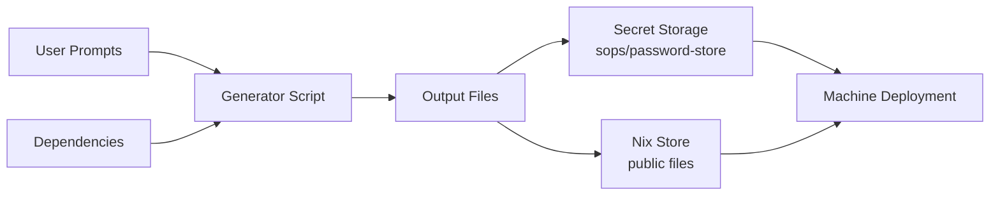
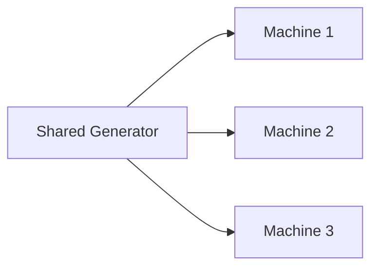

# Understanding Clan Vars - Concepts & Architecture

This guide explains the architecture and design principles behind the vars system. 

## Architecture Overview

The vars system provides a declarative, reproducible way to manage generated files (especially secrets) in NixOS configurations.

## Data Flow



## Key Design Principles

### 1. Declarative Generation

Unlike imperative secret management, vars are declared in your NixOS configuration and generated deterministically. This ensures reproducibility across deployments.

### 2. Separation of Concerns

- **Generation logic**: Defined in generator scripts
- **Storage**: Handled by pluggable backends (sops, password-store, etc.)
- **Deployment**: Managed by NixOS activation scripts
- **Access control**: Enforced through file permissions and ownership

### 3. Composability Through Dependencies

Generators can depend on outputs from other generators, enabling complex workflows:

```nix
# Dependencies create a directed acyclic graph (DAG)
A → B → C
    ↓
    D
```

This allows building sophisticated systems like certificate authorities where intermediate certificates depend on root certificates.

### 4. Type Safety

The vars system distinguishes between:
- **Secret files**: Only accessible via `.path`, deployed to `/run/secrets/`
- **Public files**: Accessible via `.value`, stored in nix store

This prevents accidental exposure of secrets in the nix store.

## Storage Backend Architecture

The vars system uses pluggable storage backends:

- **sops** (default): Integrates with clan's existing sops encryption
- **password-store**: For users already using pass

Each backend handles encryption/decryption transparently, allowing the same generator definitions to work across different security models.

## Timing and Lifecycle

### Generation Phases

1. **Pre-deployment**: `clan vars generate` creates vars before deployment
2. **During deployment**: Missing vars are generated automatically
3. **Regeneration**: Explicit regeneration with `--regenerate` flag

### The `neededFor` Option

Control when vars are available during system activation:

```nix
files."early-secret" = {
  secret = true;
  neededFor = [ "users" "groups" ];  # Available early in activation
};
```

## Advanced Patterns

### Multi-Machine Coordination

The `share` option enables cross-machine secret sharing:



This is useful for:
- Shared certificate authorities
- Mesh VPN pre-shared keys
- Cluster join tokens

### Generator Composition

Complex systems can be built by composing simple generators:

```
root-ca → intermediate-ca → service-cert
         ↓
     ocsp-responder
```

Each generator focuses on one task, making the system modular and testable.

## Key Advantages

Compared to manual secret management, vars provides:

- **Declarative configuration**: Define once, generate consistently
- **Dependency management**: Build complex systems with generator dependencies
- **Type safety**: Separate handling of secret and public files
- **User prompts**: Gather input when needed
- **Easy regeneration**: Update secrets with a single command

